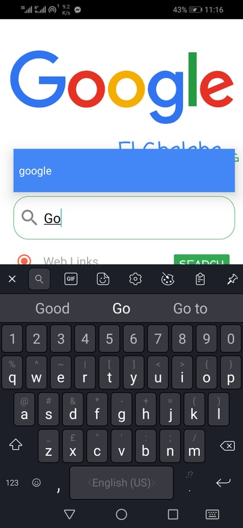
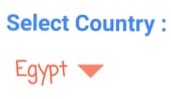

# Google el ghalaba Search engine
>   simple search engine that searches the web for links or images and supports worldwide trends
## Prerequisites

 

* Android version above 7 (API level 23) for users
* PHP MySQL for server


## Getting started
1- creating search engine data base (MySQL)

- run **crawler** by command line :

```
javac Crawler/src/MainCrawler.java
java MainCrawler.class
```
>   or you can run MainCrawler.java from intellij/eclipse directly
- run **indexer** by command line :

```
javac Crawler/src/indexer.java
java indexer.class
```
>   or you can run indexer.java from intellij/eclipse directly
- run **popularity ranker** by command line :

```
javac Crawler/src/MainRanker.java
java MainRanker.class
```

>   or you can run MainRanker.java from intellij/eclipse directly
#
2- Run Android interface on your mobile 
> setup **AndroidInterface/final apk/google_elghalaba.apk** on your mobile
######
**OR**
>  run app directly from android studio using **AndroidInterface/source code**


## using Application


#### edit your server address to send requests to with the one you have :

 - your device ip -> 192.168.1.xx: 8080
 - a tunnel you are using -> xxxxxxxxxxxx.ngrok.io
#### then choose trends or search ..
# 1-Search
#### you can search with text or voice
#### **N.B. for voice make sure to leave enough space between words and at start/end of your query for good results
|  |  |

#### **the App provides you with auto complete text based on all users old queries to help you while typing


#### now choose you want to search for web links or images and click ***"search"***

## #Results :
|WEB|IMAGES |
|--|--|
|  |  |
|  |  |

# 2-Trends
#### just choose a country to show the trends at


#### Top 10 trends < People > of the given country are displayed

